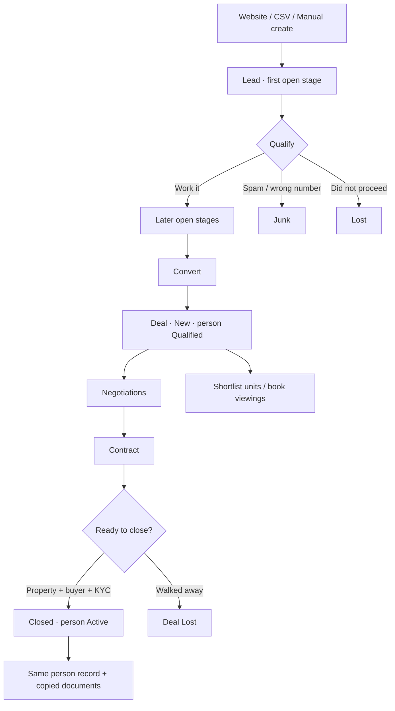

# UrbanLuxe CRM — Current System & Workflows

**Status:** this is the **live** CRM as implemented in the UrbanLuxe Portal codebase (August 2026), now evolving toward one person record, internal inventory, and first-class viewings.

Older planning files (`MASTER_CRM_ERP_SPEC.md`, `LEADS_MODULE_SPEC.md`, `URBANLUXE_CRM_BUILD_SPEC.md`) are not implemented as a rebuild. Treat this document as source of truth for how staff work the CRM now.

## Contents

1. [What the product is](#1-what-the-product-is)
2. [Information architecture](#2-information-architecture-live-nav)
3. [Roles and access](#3-roles-and-access)
4. [The core lifecycle](#4-the-core-lifecycle)
5. [Leads — data model](#5-leads--data-model)
6. [Lead stages](#6-lead-stages-configurable-board)
7. [How leads enter](#7-how-leads-enter-the-system)
8. [Assignment and routing](#8-assignment-and-routing)
9. [Working a lead](#9-working-a-lead-day-to-day)
10. [Follow-ups](#10-follow-ups)
11. [SLA](#11-sla-stale-leads)
12. [Convert lead → deal](#12-convert-lead--deal)
13. [Deals](#13-deals-pipeline)
14. [Customers](#14-customers)
15. [Documents](#15-documents)
16. [Staff and sessions](#16-staff-and-sessions)
17. [Company settings](#17-company-settings-brand)
18. [Lead Settings hub](#18-lead-settings-hub-settingsleads)
19. [Dashboard](#19-dashboard)
20. [Notifications](#20-notifications)
21. [Public site ↔ CRM](#21-public-site--crm-what-is-wired)
22. [End-to-end playbooks](#22-end-to-end-playbooks)
23. [Conventions](#23-conventions-that-affect-every-workflow)
24. [Key code map](#24-key-code-map)
25. [Not live yet](#25-explicitly-not-in-the-live-crm-yet)

---

## 1. What the product is

UrbanLuxe Portal is a **Dubai real-estate brokerage CRM** with a public marketing site in the same Next.js app.

| Surface | Who | Purpose |
|---|---|---|
| **Public site** `/(web)` | Buyers, sellers, applicants | Listings brochure, enquire / sell / careers / newsletter → CRM leads |
| **Staff portal** `/(app)` | Admin, manager, reception, agent, accountant | Qualify leads, follow up, convert to deals, close into customers |
| **Auth** `/(auth)` | Staff | Email + password login (invite-only; inactive staff cannot sign in) |

**Stack:** Next.js App Router (TypeScript) · Supabase (Postgres, Auth, Storage) · Vercel · Tailwind + shadcn/ui. Server logic is Next.js route handlers and server actions talking to Supabase. Schema lives in `supabase/migrations/`. Money is stored as **integer fils** (1 AED = 100 fils).

There is **no separate backend**. There is **no live property inventory table** in the CRM — public listings are hardcoded brochure data (`src/lib/web/listings.ts`). That is intentional for now.

---

## 2. Information architecture (live nav)

Sidebar groups Marketing / Inventory / Finance / Governance are **placeholders** (no links) while CRM is finalized.

### Workspace
| Page | Route | Roles |
|---|---|---|
| Dashboard | `/dashboard` | All staff |
| Staff | `/team` | Admin, manager, reception |

### CRM
| Page | Route | Roles |
|---|---|---|
| Lead Settings | `/settings/leads` | Admin, manager, reception |
| Leads (board / list) | `/leads?view=board` or `?view=list` | All staff (agents scoped to own + unassigned) |
| Lead detail | `/leads/[id]` | All staff (agents scoped) |
| Follow-ups | `/leads/followups` | All staff |
| Inflow (legacy URL) | `/leads/inflow` | Redirects to `/settings/leads?tab=fields` |
| Deals (pipeline) | `/deals` and `/pipeline` | All staff (agents scoped) |
| Deal detail | `/pipeline/[id]` | All staff (agents scoped) |
| People | `/customers`, `/customers/[id]` | All staff |
| Inventory | `/inventory`, `/inventory/[id]` | All staff |

### System
| Page | Route | Roles |
|---|---|---|
| Settings (company, users, emails) | `/settings` | Admin |
| Users & roles | `/settings/users` | Admin |
| Email templates | `/settings/email-templates` | Admin |

**Removed / blocked routes** (code still refuses them): campaigns, properties, quotations, invoices, payments, expenses, documents index, approvals, reports, settings/automations.

---

## 3. Roles and access

| Role | CRM data | Config | Notes |
|---|---|---|---|
| **Admin** | All leads, deals, customers | Company profile, users, email templates, lead settings, staff | Hard-delete capability |
| **Manager** | All CRM | Lead settings + staff | No company Settings |
| **Reception** | Same as manager | Same as manager | Front-desk alias of manager |
| **Agent** | **Own** leads (plus unassigned) and **own** deals | — | Dashboard is personal; cannot move others’ deals |
| **Accountant** | CRM visibility | — | Agency-wide dashboard KPIs. Capability `leads_all` / `pipeline_all` is false, but list queries only **scope agents** — accountants currently see the full lead/deal lists. |

Assignable owners for leads/deals: admin, manager, reception, agent (not accountant).

**Staff vs Users:** managers and reception run the roster from **Staff** (`/team`) — create, invite, activate, roles. **Users** (`/settings/users`) is the admin Settings card for the same profiles. Capability `user_management` is admin-only; `canManageCrm` still lets manager/reception use `/team`.

Inactive profiles cannot log in. Staff are created from **Staff** (`/team`) against Supabase Auth.

---

## 4. The core lifecycle

Everything in the CRM is built around one path:

```
Capture  →  Person row created (status Lead)  →  Qualify on the leads board  →  Convert to a Deal (person becomes Qualified)  →  Shortlist units / book viewings  →  Close  →  Person becomes Active (client_since stamped)
                │                              │
                ├─ Follow-ups / SLA            ├─ Property + KYC + payment on the deal
                ├─ Lost / Junk → person Lost   └─ Lost (reason required)
                └─ Documents stay on the lead, then copy to deal, then to customer
```

**Important rule:** converting a lead does **not** create a new person. The person exists from first contact (`leads.customer_id`). Closing the deal **activates** that person (`status = active`, `client_since`). Walk-in clients created from People stay `active` immediately.



---

## 5. Leads — data model

A lead is a **person with a requirement**, not just a contact row.

### Identity & contact
- `name`, `phone` (UI label **WhatsApp**), `email` (normalized copies `phone_norm` / `email_norm` for matching)
- `nationality` (list managed in Lead Settings → `lead_nationalities`)
- `source` (website, import, manual, WhatsApp, etc. — picklist)

The field catalog is `LEAD_SNAPSHOT_FIELDS` in `src/lib/lead-snapshot-fields.ts`. Create-lead hides lost/junk reasons and document category.

### Requirement (“tastes”)
- `interest` — buy / rent / off_plan / sell (website variants map into these)
- `category`, `bedrooms`, `purpose`
- `preferred_areas` — text array; names come from `lead_areas`
- `budget` in the UI is a **band** from `lead_field_options`; stored as `budget_min` / `budget_max` **fils**

### Financing & scoring
- `financing`, `timeframe`
- `score` — 0–100 or a configured band
- `tags[]`, `notes`

### Pipeline chrome
- `stage_id` → `lead_stages` (names/colors/order are **data**, not code)
- `status` — legacy mirror: `new` | `qualified` | `converted` | `unqualified`
- `assigned_to` → `profiles`
- `next_follow_up_at`
- `lost_reason` / `junk_reason`
- `converted_deal_id` / `converted_customer_id`
- `stage_entered_at`, `last_activity_at`
- `deleted_at` — soft delete

Picklists (`lead_field_options`) are the admin-editable lists for source, interest, category, bedrooms, purpose, timeframe, financing, budget bands, tags, score bands, lost/junk reasons, and document categories.

---

## 6. Lead stages (configurable board)

Stages live in `lead_stages`. Each has:

| Field | Meaning |
|---|---|
| `name`, `color`, `sort` | Column header on the board |
| `kind` | `open` · `won` · `lost` · `junk` — reporting stays stable if names change |
| `stale_after_days` | SLA: days a lead may sit in this stage |
| `required_fields` | Fields that must be filled before a lead can enter the stage |
| `helper_text` | Shown in Lead Settings |
| `is_active` | Inactive stages disappear from the board |

**Seeded default journey** (admins can rename/reorder/add/delete, except system kinds still need a won/lost/junk home):

| Sort | Name | Kind | Typical SLA | Required to enter |
|---|---|---|---|---|
| 1 | New | open | 1 day | — |
| 2 | Contacted | open | 2 days | — |
| 3 | Qualified | open | 5 days | `budget_min`, `interest`, `preferred_areas` |
| 4 | Viewing Scheduled | open | 3 days | `viewing_scheduled` (**not enforced yet** — skipped in `updateLeadStage`) |
| 5 | Viewing Done / Offer | open | 2 days | — |
| 6 | Converted | **won** | — | Set by Convert — do not drag here as the happy path |
| 7 | Lost | **lost** | — | `lost_reason` |
| 8 | Junk | **junk** | — | `junk_reason` |

**Default stage for new leads:** first active stage with `kind = open`, ordered by `sort`.

Moving a lead (`updateLeadStage`):
1. Load stage + lead.
2. If `required_fields` are missing, reject with a list (lost/junk reasons collected in the move dialog). `viewing_scheduled` and `activity_logged` are **skipped** until a later pass.
3. Update `stage_id`, reset `stage_entered_at` when the column actually changes.
4. Mirror `status` from `kind` (won → converted, lost/junk → unqualified, open → new/qualified by sort).
5. Write `lead_events` (`stage_changed`) and a `lead_activities` note.

Won stages are normally reached by **Convert**, which also creates the deal.

---

## 7. How leads enter the system

### 7.1 Manual create (portal)

**+ Create** on `/leads` opens a form driven by `LEAD_SNAPSHOT_FIELDS` (Contact, Tastes, Financing, Notes, Scoring). Lost/junk reasons and document category are hidden on create.

- Duplicate guard: same phone or email among non-deleted leads → error naming the existing lead.
- If no assignee is chosen, **round-robin routing** runs (see §8).
- `created_by` is the signed-in staff user.
- Activity: `lead_events.kind = created` + activity log.

### 7.2 Public website (no login)

Server actions in `src/server/public-leads.ts` insert leads with service role (same as staff, no API key in the browser).

| Form | Source stamp | Interest mapping | Extra |
|---|---|---|---|
| Enquire (contact, property, property-management) | `website-enquire` or `website-property` | buy / rent / off_plan / sell | Property title + message in notes |
| List / valuation (`ListPropertyForm`) | `website-sell` or `website-valuation` | sell / rent / both → sell | Address, type, beds |
| Careers | `website-careers` | stored as `buy` (placeholder) | Role, experience, LinkedIn; CV uploaded to private `careers` bucket; path in notes |
| Newsletter | `website-newsletter` | `buy` | Email-only (phone optional) |

**Honeypot:** hidden `company` field — bots that fill it get a fake success and no lead.

**Duplicates:** matching phone or email does **not** create a second lead. A note is appended (`Repeat website enquiry…`) and the UI says they already have the details.

**Webhook (external):** `POST /api/leads/webhook` with header `x-api-key` matching env `LEAD_API_KEY`. Body needs `name`; optional phone, email, source (default `website`), interest (default `buy`), notes, preferred_areas, `assigned_to`. `budget_min` / `budget_max` in the body are treated as **AED** and stored as fils. Duplicate phone/email returns `{ ok: true, id }` of the existing lead (no extra activity note — unlike public forms). `GET` is a health check. The public site uses server actions, not this webhook from the browser.

### 7.3 CSV import

Lead Settings → Imports (admin / manager / reception). Up to 500 rows per run. Columns map onto snapshot fields; budget/score cells can be band labels or numbers. Unassigned imported leads are routed round-robin (`reason: import`).

---

## 8. Assignment and routing

`applyLeadRouting` (`src/server/routing.ts`):

1. If the lead already has `assigned_to`, keep it.
2. Else pick the **least-loaded active agent** (`profiles.role = agent`, `is_active`). Load = count of non-deleted leads currently assigned to them.
3. Write `assigned_to`, insert `lead_assignments` (`reason` like `round_robin:created` / `import` / `webhook`).
4. In-app notification: `lead_assigned` for that agent.

**Manual assign** (`assignLead`, `bulkAssignLeads`) from board/list/detail.

**Claim:** an agent can take an **unassigned** lead (`claimLead`) — conditional update so two people cannot claim the same row.

**Agent visibility:**
- Leads board/list: `assigned_to = me OR assigned_to IS NULL` (pool of unassigned).
- Deals: `assigned_to = me` only.

---

## 9. Working a lead (day-to-day)

### Board (`/leads?view=board`)
Kanban columns = active stages. Cards drag between columns. Filters: search, source, assignee. Duplicate phone highlighting exists on the board. Convert is available once the lead is qualified enough for a deal.

### List (`/leads?view=list`)
Table of up to 100 recent leads with the same filters plus stage. Bulk assign is available to CRM managers.

### Lead detail (`/leads/[id]`)
Single record: contact + requirement fields, stage, assignee, score, tags, notes, **viewings**, documents, activity timeline, follow-up scheduler, convert dialog. Links to the person record from capture.

### Activities
`lead_activities` types include notes, stage changes, follow-up scheduled/done, converted, assignment. `lead_events` is a more structured audit (`created`, `stage_changed`, …). `activity_log` is the cross-entity audit (dashboard “recent activity”).

### Documents on a lead
Uploaded to Storage, row in `documents` with `entity_type = lead`. Category picklist from Lead Settings; some categories capture an **expiry date** (Emirates ID, passport, visa, tenancy, permit, NOC, BRN), others a **note**. On convert, copies are attached to the **deal**. On close, copies attach to the **customer**.

---

## 10. Follow-ups

Follow-ups are first-class, not just a date on the lead.

| Table / field | Role |
|---|---|
| `leads.next_follow_up_at` | Next due time shown everywhere |
| `lead_follow_ups` | History: scheduled / snoozed / completed |

**Schedule:** new row `status = scheduled`; previous scheduled rows for that lead become `snoozed`; lead’s `next_follow_up_at` updates.

**Complete:** mark current follow-up done; optional note; typically prompt for the next date so the lead does not go silent.

**Snooze:** push the datetime; keep the lead on the follow-ups list.

**Follow-ups page** (`/leads/followups`): triage by overdue / today / upcoming. Dashboard also lists upcoming follow-ups and an overdue count.

---

## 11. SLA (stale leads)

Each open stage can have `stale_after_days`. Clock starts at `stage_entered_at` (reset when the lead changes column).

**Daily cron** `GET /api/cron/daily` (Vercel, `0 6 * * *`, `Authorization: Bearer CRON_SECRET`):

1. Documents expiring in 30 days → notify **admins**.
2. Leads past stage SLA → notify the **assignee**, plus a digest to **admin + manager**.

Won / lost / junk stages are excluded from SLA.

---

## 12. Convert lead → deal

Action: `convertLead` (dialog on lead detail / board).

If `converted_deal_id` already exists, it returns that deal (idempotent).

Otherwise it:

1. Builds `lead_context` JSON (snapshot of source, interest, budget, areas, financing, tags, …).
2. Inserts a **deal** in stage `new` with:
   - `title` from property title or lead name
   - `deal_type` from interest: `sale` | `rental` | `off_plan`
   - `value` from `budget_max` (else `budget_min`)
   - `assigned_to` copied from the lead
   - buyer + KYC copied from the lead (overridable in the dialog)
   - property fields (title, community, building, unit, ref) + `property_snapshot`
   - `customer_id` from the person created at capture
   - `lead_id` + `lead_context`
3. Moves the lead to the **won** stage, sets `status = converted`, stores `converted_deal_id`, and attaches `customer_id` on the deal. Person status becomes **qualified**.
4. Copies lead documents onto the deal.
5. Writes activities on both lead and deal.

Staff then work the deal on `/pipeline/[id]` / `/deals` — shortlist inventory units and book viewings.

---

## 13. Deals (pipeline)

Deals are the **transaction**, not the person.

### Stages (code enums, not admin-editable)

| Stage | Meaning |
|---|---|
| `new` | Just converted or created |
| `negotiations` | Offer / terms |
| `contract` | Paperwork |
| `closed` | Won — **activates the person** (`active` + `client_since`) |
| `lost` | Lost — `lost_reason` required |

Legacy names (`inquiry`, `viewing`, `offer`, `won`, …) still **normalize** to the table above.

Agents may only move deals assigned to them.

### Deal record
- Commercial: `value`, `commission_amount` / rate, `deal_type`
- People: `buyer_*`, `kyc_*` (nationality, Emirates ID, passport, TRN)
- Asset: `property_title`, community, building, unit, ref, `property_snapshot`
- Payment: method, deposit, balance, schedule JSON, notes
- Links: `lead_id`, `customer_id`, `assigned_to`
- `finalized_at` once closed

### Closing a deal

`updateDealStage({ stage: "closed" })`:

1. **Readiness gate** (`dealReadyToFinalize`): property title, buyer name, and **Emirates ID or passport**.
2. RPC `finalize_deal_to_customer` creates (or links) a **customer**, copies KYC/property onto that record, sets `deals.customer_id` and `finalized_at`.
3. Copies deal (+ original lead) documents onto the customer.
4. Deal activity type `won`.

Until those fields exist, the UI should keep the deal in Contract/Negotiations.

Manual **create deal** exists for edge cases (existing relationship without a lead); the happy path is convert.

---

## 14. People (customers)

Created at **lead capture** (`status = lead`). Convert sets `qualified`. Deal close sets `active` and stamps `client_since`. Lost/junk leads set `lost` if the person was still in a working status. Manual **Add** from People creates an `active` walk-in.

Typical fields: name, phone, email, nationality, Emirates ID, passport, TRN, address, tags, notes, `assigned_to`, status (`lead` / `qualified` / `active` / `inactive` / `lost`).

Person detail shows linked deals, acquired properties, and documents. Nav label is **People**; the URL is still `/customers`.

---

## 15. Documents

| Piece | Behaviour |
|---|---|
| Storage | Supabase Storage; signed URLs for download |
| Metadata | `documents` table: name, category, expiry, notes, `entity_type` + `entity_id` |
| Categories | Lead Settings → Fields → `doc_category` |
| Capture mode | `expiry` vs `note` (per category) |
| Copy rules | Lead → Deal on convert; Lead+Deal → Customer on close |
| Careers CVs | Private `careers` bucket; path stored on the **lead notes**, not the documents table |

Standalone `/documents` UI is currently a removed route; documents are managed **on the entity** (lead / deal / customer / staff).

---

## 16. Staff and sessions

`/team` (admin, manager, reception):

- Create staff (Auth user + `profiles` row): name, email, role, BRN, commission rate, avatar
- Invite / set password / send reset link
- Activate / deactivate (deactivated users cannot log in)
- Per-person lead and deal counts on the roster

**Sessions:** `staff_sessions` heartbeat from the portal (`SessionHeartbeat`) so activity can be reported (`getStaffActivityStats`).

Assignable agents on public listing cards come from active admin/manager/agent profiles (`getPublicAgents`).

---

## 17. Company settings (brand)

`/settings` (admin):

- Primary logo — public header (light backgrounds)
- **White logo** — admin sidebar, login dark panel, public footer
- Phone, WhatsApp digits, email, address, RERA ORN, tagline, TRN, VAT, quotation/invoice prefixes
- LinkedIn / Instagram URLs (footer)

`getPublicBrand()` feeds both the public site and the portal chrome. Changing settings revalidates public + admin layouts.

Email templates (`/settings/email-templates`) store transactional subject/body; sending still depends on `RESEND_API_KEY` being configured.

---

## 18. Lead Settings hub (`/settings/leads`)

Tabs:

| Tab | What staff configure |
|---|---|
| **Overview** | Counts of stages, SLA coverage, fields; short “how leads move” copy |
| **Lead Flow** | Explains Lead → Deal → Customer and field mappings (`FIELD_MAPPINGS`) |
| **Fields** | Picklists and areas/nationalities; budget/score bands; document categories |
| **Stages** | Names, SLA days, required fields, lost/junk reason lists |
| **Imports** | CSV map-and-import |

This is the operational control plane. Changing a picklist or stage does **not** require a deploy.

---

## 19. Dashboard

`/dashboard` shows:

- Pipeline value (sum of **open** deal `value` in fils) and active deal count
- Open leads, new leads this month, customers
- Overdue follow-ups
- Upcoming follow-ups
- Recent `activity_log`

Agents see **their** numbers; admin/manager/reception/accountant see agency-wide (accountant has `dashboard_full`).

---

## 20. Notifications

In-app `notifications` rows (bell in the top bar), not SMS.

| Kind | When |
|---|---|
| `lead_assigned` | Round-robin or assignment |
| `lead_stale` | Daily SLA breach |
| `doc_expiring` | Daily, docs in the next 30 days |

---

## 21. Public site ↔ CRM (what is wired)

**Wired**
- Enquire, sell/valuation, careers, newsletter → leads + routing
- Company brand (logos, phone, socials) from Settings
- Currency switcher on public prices (display FX only)
- Header/footer/legal (privacy, terms), sitemap/robots

**Not CRM inventory**
- Buy/rent/off-plan cards are static `LISTINGS`
- Insights / careers role copy are static TypeScript
- Map on search opens Google Maps for the area, not a pin database

---

## 22. End-to-end playbooks

### A. Website buyer enquiry
1. Visitor submits Enquire on a listing or `/contact`.
2. Lead created, source `website-enquire` or `website-property`, first **open** stage.
3. Round-robin to an active agent + notification.
4. Agent claims if unassigned, calls/WhatsApps, logs activity, sets a follow-up.
5. Drag toward Qualified / Viewing; fill budget, interest, areas when the stage requires them.
6. Convert → deal in **New**; work Negotiations → Contract.
7. Fill property + buyer + KYC → Close → customer + documents.

### B. Seller / valuation
1. `/sell` or `/valuations` form → source `website-sell` / `website-valuation`, interest `sell`.
2. Same qualify/follow-up path; conversion still opens a deal (sale) when they instruct.

### C. Career application
1. Form + optional CV → lead with source `website-careers`.
2. Hiring desk works it as a lead (not a separate ATS). CV path is in notes.

### D. Walk-in / phone (reception)
1. Create lead on the board, optionally assign a named agent (skips round-robin).
2. If phone/email matches, system blocks the duplicate — open the existing lead instead.

### E. Lost / junk
- **Junk:** wrong number, spam, duplicate — excluded from conversion thinking; reason required.
- **Lost:** real prospect who walked — reason required (price, competitor, financing, unresponsive, postponed, …).
- Neither creates a deal.

### F. Deal lost after convert
Move deal to **Lost** with a reason. Customer is **not** created. Lead remains converted (already has `converted_deal_id`).

---

## 23. Conventions that affect every workflow

- **Soft delete** (`deleted_at`) — lists filter it out; webhook/public duplicate checks do too.
- **Money** — integer fils in the database; UI shows AED.
- **Service role** — mutations go through server actions / cron / webhook, not the browser anon key for writes.
- **Revalidation** — after mutations, paths like `/leads`, `/pipeline`, `/customers` are revalidated.
- **Agent vs house** — never assume an agent sees the full board; unassigned leads are the shared pool. Customers list is also agent-scoped (`assigned_to = me`).

---

## 24. Key code map

| Concern | Where |
|---|---|
| Nav & roles | `src/lib/nav.ts`, `src/lib/permissions.ts` |
| Lead snapshot fields | `src/lib/lead-snapshot-fields.ts` |
| Lead stages helper | `src/lib/lead-stages.ts` |
| Convert mapping | `src/lib/lead-flow.ts` |
| Deal stages | `src/lib/deal-stages.ts` |
| Close readiness | `src/lib/deal-transaction.ts` |
| Lead mutations | `src/server/leads.ts` |
| Deal mutations | `src/server/deals.ts` |
| Customers | `src/server/customers.ts` |
| Routing | `src/server/routing.ts` |
| Person-from-capture | `src/server/people.ts` |
| Inventory | `src/server/inventory.ts` |
| Viewings | `src/server/viewings.ts` |
| Public capture | `src/server/public-leads.ts` |
| Webhook | `src/app/api/leads/webhook/route.ts` |
| Daily jobs | `src/app/api/cron/daily/route.ts` |
| Brand | `src/lib/company-brand.ts`, `src/server/company-settings.ts` |
| Schema | `supabase/migrations/` (leads module from `0010_leads_module.sql` onward) |

---

## 25. Explicitly not in the live CRM (yet)

These appear in older specs or empty nav groups:

- Public website inventory (still hardcoded brochure listings)
- Quotations, invoices, cheques, payments, expenses
- Marketing campaigns and automation rules UI
- Calendar view of all viewings
- Teams / team_lead / Postgres RLS rebuild
- Bitrix-style saved filters, first-response 15-minute SLA rings
- Hard real-time board sync (board is request/revalidate, not a live channel)

**Now live that used to be missing:** person-from-capture, internal inventory (`/inventory`), deal shortlist, scheduled viewings with outcomes (enforces the Viewing Scheduled stage when a viewing exists).

When those remaining items ship, update **this** file — do not revive the old specs as if they were implemented.
